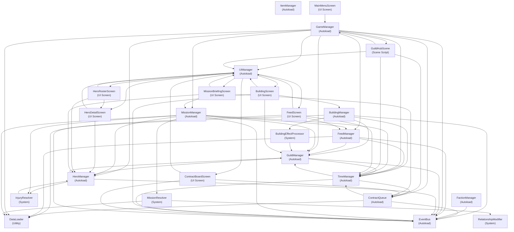

# Object Interaction Guide

Auto-generated map of current object interactions across autoloads, systems, UI scripts, scene scripts, utilities, and models.

## 1) High-level interaction graph

## 2) Per-object dependency map

| Object | Type | Interacts with |
|---|---|---|
| `BuildingData` | Model | GuildState |
| `BuildingEffectProcessor` | System | BuildingData, GuildManager |
| `BuildingManager` | Autoload | BuildingData, BuildingEffectProcessor, DataLoader, EventBus, GuildManager, TimeManager |
| `BuildingScreen` | UI Screen | BuildingManager, BuildingSlot, EventBus, GuildManager, UIManager |
| `BuildingSlot` | UI Component | BuildingData, BuildingManager, EventBus, GuildManager, TimeManager |
| `ContractBoardScreen` | UI Screen | ContractCard, ContractData, ContractQueue, EventBus, UIManager |
| `ContractCard` | UI Component | ContractData, Enums |
| `ContractData` | Model | ContractQueue, Enums |
| `ContractQueue` | Autoload | ContractData, DataLoader, EventBus, TimeManager |
| `DataLoader` | Utility | BuildingData, ContractData, Enums, FactionData, HeroData, HeroRelationship, ItemData |
| `EventBus` | Autoload | Enums |
| `FactionData` | Model | Enums, FactionManager |
| `FactionManager` | Autoload | EventBus |
| `FeedEntry` | UI Component | FeedEvent |
| `FeedManager` | Autoload | DataLoader, Enums, EventBus, FeedEvent, GuildManager, TimeManager |
| `FeedScreen` | UI Screen | EventBus, FeedEntry, FeedEvent, FeedManager, InterventionPrompt, TimeManager, UIManager |
| `GameManager` | Autoload | ContractQueue, DataLoader, Enums, EventBus, FeedManager, GuildHubScene, GuildManager, HeroData, HeroManager, MissionManager, TimeManager, UIManager |
| `GuildHubScene` | Scene Script | ContractQueue, Enums, GameManager, TimeManager, UIManager |
| `GuildManager` | Autoload | Enums, EventBus, GuildState, HeroManager, TimeManager |
| `GuildState` | Model | GuildManager |
| `HUDBar` | Object | EventBus, GuildManager, HeroManager, TimeManager |
| `HeroData` | Model | Enums, HeroRelationship |
| `HeroDetailScreen` | UI Screen | Enums, HeroData, HeroManager, HeroRelationship, UIManager |
| `HeroManager` | Autoload | Enums, EventBus, GuildManager, HeroData, InjuryResolver |
| `HeroPortraitCard` | UI Component | Enums, HeroData, HeroRosterScreen, MissionBriefingScreen |
| `HeroRelationship` | Model | Enums |
| `HeroRosterScreen` | UI Screen | Enums, HeroData, HeroDetailScreen, HeroManager, HeroPortraitCard, UIManager |
| `InjuryResolver` | System | Enums, HeroData, HeroManager |
| `InterventionPrompt` | UI Component | Enums, EventBus, GuildManager, MissionManager |
| `ItemData` | Model | Enums |
| `MainMenuScreen` | UI Screen | GameManager |
| `MissionBriefingScreen` | UI Screen | ContractData, ContractQueue, Enums, HeroData, HeroManager, HeroPortraitCard, MissionManager, UIManager |
| `MissionManager` | Autoload | ContractData, DataLoader, Enums, EventBus, FeedManager, GuildManager, HeroData, HeroManager, InjuryResolver, MissionResolver, TimeManager |
| `MissionResolver` | System | ContractData, DataLoader, Enums, HeroData, ItemData, RelationshipModifier |
| `RelationshipModifier` | System | HeroData, HeroRelationship |
| `TimeManager` | Autoload | ContractQueue, Enums, EventBus, GuildManager |
| `UIManager` | Autoload | BuildingScreen, ContractBoardScreen, FeedScreen, HeroDetailScreen, HeroRosterScreen, MissionBriefingScreen |
| `enums` | Object | Enums |

## 3) EventBus signal interaction matrix

| Signal | Emitted by | Consumed via connect() by |
|---|---|---|
| `day_advanced` | TimeManager | BuildingManager, BuildingSlot, GuildManager, HUDBar, HeroManager, MissionManager |
| `night_began` | TimeManager | — |
| `week_advanced` | TimeManager | — |
| `hero_dispatched` | MissionManager | HUDBar |
| `hero_returned` | MissionManager | HUDBar |
| `hero_wounded` | HeroManager | HUDBar |
| `hero_killed` | HeroManager | HUDBar |
| `hero_captured` | HeroManager | HUDBar |
| `hero_trait_acquired` | — | — |
| `hero_morale_changed` | GuildManager | — |
| `contract_available` | ContractQueue | ContractBoardScreen |
| `contract_accepted` | MissionManager | ContractBoardScreen |
| `contract_completed` | MissionManager | — |
| `contract_expired` | ContractQueue | — |
| `messenger_arrived` | — | — |
| `feed_event` | MissionManager | FeedManager |
| `feed_intervention_available` | FeedManager | FeedScreen |
| `intervention_used` | InterventionPrompt | FeedManager |
| `reputation_changed` | — | — |
| `faction_became_enemy` | — | — |
| `faction_became_ally` | — | — |
| `building_construction_started` | BuildingManager | BuildingSlot |
| `upgrade_built` | BuildingManager | BuildingSlot |
| `guild_attacked` | — | — |
| `gold_changed` | GuildManager | BuildingScreen, BuildingSlot, HUDBar |
| `state_changed` | GameManager | — |
